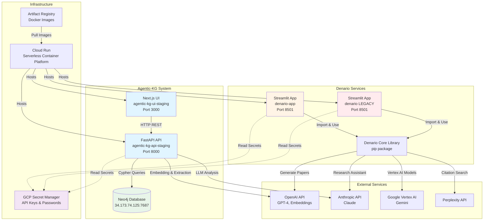
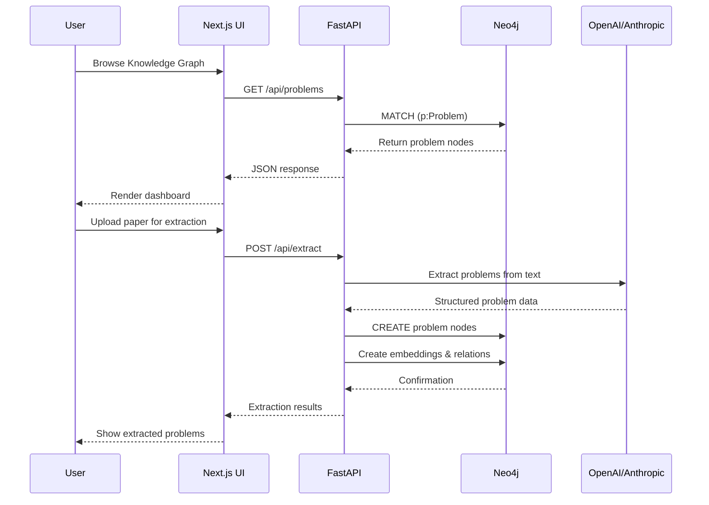
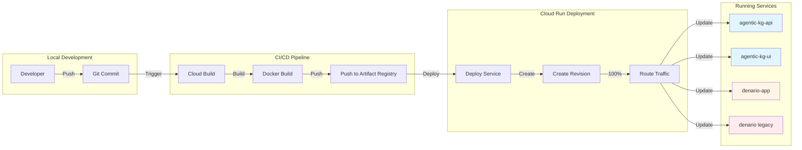

# Sprint 08: Documentation & Service Cleanup

**Status:** Complete ✅
**Start Date:** 2026-02-04
**Completion Date:** 2026-02-05
**GitHub Pages:** <https://djjay0131.github.io/agentic-kg/>

## Overview

Consolidate and document all deployed services across agentic-kg and Denario projects. Create a comprehensive GitHub Pages front page to serve as the central documentation hub for all services.

## Goals

1. Document all deployed Cloud Run services with clear purpose and URLs
2. Consolidate redundant Denario services (denario vs denario-app)
3. Create GitHub Pages site as service directory
4. Fix UI deployment issues (API URL configuration)
5. Update memory bank with service architecture

## Current Service Inventory

### Agentic-KG Services

| Service | URL | Purpose | Status |
|---------|-----|---------|--------|
| agentic-kg-api-staging | https://agentic-kg-api-staging-542888988741.us-central1.run.app | FastAPI backend for knowledge graph | ✅ Healthy |
| agentic-kg-ui-staging | https://agentic-kg-ui-staging-542888988741.us-central1.run.app | Next.js frontend dashboard | ⚠️ API URL config issue |

### Denario Services

| Service | URL | Repository | Version |
|---------|-----|------------|---------|
| denario | https://denario-542888988741.us-central1.run.app | [Denario](https://github.com/djjay0131/Denario) | Older (commit 5d5713e) |
| denario-app | https://denario-app-542888988741.us-central1.run.app | [DenarioApp](https://github.com/djjay0131/DenarioApp) | Modified (commit b5e1270) |

**Issue:** Both services run Streamlit apps, but denario-app has:
- File upload restrictions (.md/.txt only)
- Vertex AI integration improvements
- Production bug fixes

### Multiple URLs Per Service (Discovery)

**Finding:** Each Cloud Run service has TWO URL formats:

| Service | Legacy URL (Project Number) | New URL (Random String) |
|---------|------------------------------|-------------------------|
| denario | https://denario-542888988741.us-central1.run.app | https://denario-tqpsba7pza-uc.a.run.app |
| denario-app | https://denario-app-542888988741.us-central1.run.app | https://denario-app-tqpsba7pza-uc.a.run.app |
| agentic-kg-api-staging | https://agentic-kg-api-staging-542888988741.us-central1.run.app | https://agentic-kg-api-staging-tqpsba7pza-uc.a.run.app |
| agentic-kg-ui-staging | https://agentic-kg-ui-staging-542888988741.us-central1.run.app | https://agentic-kg-ui-staging-tqpsba7pza-uc.a.run.app |

**Note:** Both URLs point to the same service. The new format is returned by `gcloud run services describe`, while `gcloud run services list` shows the legacy format.

## Requirements

### FR-8.1: Service Documentation

**Priority:** High

Create comprehensive documentation for all services including:
- Service purpose and architecture
- API endpoints and schemas
- Environment variables and secrets
- Deployment procedures
- Health check endpoints

**Acceptance Criteria:**
- [ ] All services have README.md files
- [ ] API documentation generated (OpenAPI/Swagger)
- [ ] Environment variables documented
- [ ] Deployment runbooks created

### FR-8.2: GitHub Pages Site

**Priority:** High

Create a GitHub Pages site at `https://djjay0131.github.io/agentic-kg/` (or similar) serving as the central hub.

**Page Structure:**
```
/
├── index.html           # Service directory homepage
├── services/
│   ├── agentic-kg.html  # Agentic KG documentation
│   └── denario.html     # Denario documentation
├── api/
│   └── swagger.html     # API documentation
└── guides/
    ├── deployment.html  # Deployment guide
    └── development.html # Development setup
```

**Acceptance Criteria:**
- [ ] GitHub Pages enabled on repository
- [ ] Homepage with service cards/directory
- [ ] Links to all deployed services
- [ ] Architecture diagrams
- [ ] Getting started guide
- [ ] API documentation embedded

### FR-8.3: Denario Service Consolidation

**Priority:** Medium

Consolidate the two Denario services to reduce confusion and costs.

**Decision Points:**
- Which service to keep (recommend: denario-app)
- Whether to migrate any data/state
- URL redirect strategy

**Acceptance Criteria:**
- [ ] Identify which service is actively used
- [ ] Document differences between services
- [ ] Create migration plan if needed
- [ ] Deprecate older service
- [ ] Update all references to point to active service

### FR-8.4: UI Deployment Fix

**Priority:** High

Fix the agentic-kg UI deployment issue where API URL is not properly configured.

**Root Cause:** Next.js requires `NEXT_PUBLIC_API_URL` at build time, not runtime.

**Acceptance Criteria:**
- [ ] UI rebuild completes successfully
- [ ] UI can connect to staging API
- [ ] Health check shows "Online" status
- [ ] Dashboard displays data from API
- [ ] Verify build includes correct API URL

### FR-8.5: Memory Bank Updates

**Priority:** Medium

Update memory bank documentation with current architecture.

**Files to Update:**
- `memory-bank/activeContext.md` - Current service status
- `memory-bank/techContext.md` - Denario architecture
- `memory-bank/progress.md` - Sprint 08 tracking

**Acceptance Criteria:**
- [ ] All services documented in techContext
- [ ] Service URLs in activeContext
- [ ] Architecture diagrams added
- [ ] API key configuration documented

## Tasks

### Phase 1: Investigation (Complete)

- [x] List all Cloud Run services
- [x] Identify service purposes
- [x] Compare Denario vs DenarioApp code
- [x] Investigate mystery denario service (https://denario-tqpsba7pza-uc.a.run.app) - Just new URL format
- [x] Document service dependencies

### Phase 2: Documentation (Complete)

- [x] Create service inventory spreadsheet/table (SERVICE_INVENTORY.md)
- [x] Generate OpenAPI specs for APIs (FastAPI auto-generates at /docs)
- [x] Write service README files (documented in SERVICE_INVENTORY.md)
- [x] Create architecture diagrams (Mermaid/PlantUML) - 3 diagrams in sprint-08.md
- [x] Document environment variables (in SERVICE_INVENTORY.md)

### Phase 3: GitHub Pages Setup (Complete)

- [x] Enable GitHub Pages on agentic-kg repo (Live at <https://djjay0131.github.io/agentic-kg/>)
- [x] Choose theme/template (custom HTML with minimal Jekyll)
- [x] Create homepage with service directory
- [x] Add service detail pages (SERVICE_INVENTORY.md)
- [x] Embed API documentation (Swagger UI) - Links to FastAPI /docs endpoint
- [x] Add deployment guides
- [x] Create automated documentation agent
- [x] Set up GitHub Actions workflow for auto-updates

### Phase 4: Service Cleanup

- [ ] Verify denario-app is the preferred service
- [ ] Check for any active users of old denario service
- [ ] Plan deprecation of old service
- [ ] Set up URL redirects if needed
- [ ] Delete or scale down redundant service

### Phase 5: UI Deployment Fix

- [ ] Monitor current UI rebuild (in progress)
- [ ] Verify build includes NEXT_PUBLIC_API_URL
- [ ] Test UI connectivity to API
- [ ] Validate all UI pages load correctly
- [ ] Update deployment documentation

### Phase 6: Memory Bank Updates (In Progress)

- [x] Update activeContext.md with Sprint 08 completion
- [ ] Add Denario architecture to techContext.md
- [x] Document all service URLs (in SERVICE_INVENTORY.md and docs/index.html)
- [ ] Update progress.md with completion status

### Phase 7: Documentation Automation (Complete)

- [x] Create documentation generator agent (.github/scripts/generate_docs.py)
- [x] Set up GitHub Actions workflow (.github/workflows/update-docs.yml)
- [x] Configure auto-trigger on memory-bank/ and construction/ changes
- [x] Add manual workflow trigger option
- [x] Document automation in .github/scripts/README.md
- [x] Test workflow with real sprint completion (GitHub Pages build verified)
- [ ] Add error notifications for failed workflows (future enhancement)

## Technical Details

### GitHub Pages Configuration

**Option 1: Jekyll (Recommended)**
```yaml
# _config.yml
theme: jekyll-theme-minimal
title: Agentic KG Services
description: Central hub for research knowledge graph services

collections:
  services:
    output: true
    permalink: /services/:name/
```

**Option 2: Custom HTML/React**
- Build static site with Vite/Next.js
- Deploy to gh-pages branch
- More control over design

### Service Architecture Diagram



### Data Flow Diagram



### Deployment Architecture



## Dependencies

- GitHub repository with Pages enabled
- Access to Cloud Run services
- GCP Secret Manager access
- Documentation theme/template

## Risks & Mitigation

| Risk | Impact | Mitigation |
|------|--------|------------|
| Breaking active Denario users | High | Survey usage before deprecating service |
| UI rebuild fails | Medium | Have rollback plan, validate build args |
| GitHub Pages setup complexity | Low | Use simple Jekyll theme initially |
| Documentation drift | Medium | Set up automated API doc generation |

## Success Metrics

- [ ] All services documented with ≥80% coverage
- [ ] GitHub Pages live and accessible
- [ ] UI deployment fixed and verified
- [ ] Zero redundant services running
- [ ] Memory bank up to date

## Notes

- CLAUDE.md is outdated (references DenarioApp in Windows paths)
- Need to clarify if mystery denario service is still needed
- Consider automating service inventory updates
- API documentation should be generated from code (OpenAPI)

## References

- [GitHub Pages Documentation](https://docs.github.com/en/pages)
- [OpenAPI Specification](https://swagger.io/specification/)
- [Mermaid Diagrams](https://mermaid.js.org/)
- Sprint 07: E2E Testing (previous sprint)
