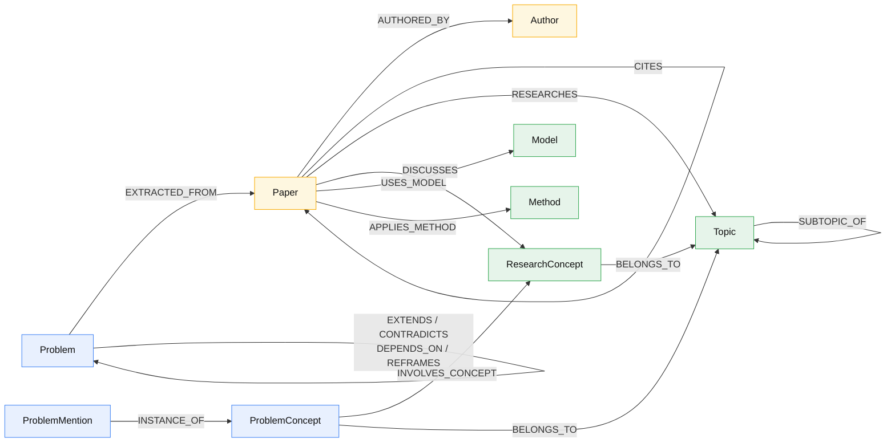

# Entity Relationships

The authoritative catalog of **edge types** in the knowledge graph — their
endpoints, direction, cardinality, and semantics. Node types are defined in the
[Entity Catalog](entity-catalog).

Source of truth: `models/relationships.py` (typed relations + properties) and the
Cypher `MERGE (...)-[:EDGE]->(...)` statements in `repository.py`.

## Graph shape (diagram)

## Research & classification edges

| Edge | From → To | Cardinality | Semantics |
|------|-----------|-------------|-----------|
| `EXTRACTED_FROM` | `Problem` → `Paper` | many-to-one | Problem was extracted from this paper (carries `section`, `extraction_date`) |
| `INSTANCE_OF` | `ProblemMention` → `ProblemConcept` | many-to-one | This paper-specific mention is an instance of the canonical concept (carries `confidence`, `match_method`, `matched_by`) |
| `INVOLVES_CONCEPT` | `ProblemConcept` → `ResearchConcept` | many-to-many | The problem involves this research concept |
| `BELONGS_TO` | `ProblemConcept` / `ResearchConcept` → `Topic` | many-to-one(ish) | The problem-side node is classified under this topic |
| `RESEARCHES` | `Paper` → `Topic` | many-to-many | The paper researches this topic |
| `DISCUSSES` | `Paper` → `ResearchConcept` | many-to-many | The paper discusses this concept |
| `USES_MODEL` | `Paper` → `Model` | many-to-many | The paper uses/benchmarks this model |
| `APPLIES_METHOD` | `Paper` → `Method` | many-to-many | The paper applies this method |
| `SUBTOPIC_OF` | `Topic` → `Topic` | many-to-one | Child topic rolls up into its parent (`subtopic → area → domain`) |

## Bibliographic edges

| Edge | From → To | Cardinality | Semantics |
|------|-----------|-------------|-----------|
| `AUTHORED_BY` | `Paper` → `Author` | many-to-many | Authorship; carries `author_position` (1 = first author) |
| `CITES` | `Paper` → `Paper` | many-to-many | Citation; populated from Semantic Scholar reference lists (E-5). Denormalized on `Paper.citation_count` / `reference_count` |

## Problem-to-problem edges

All four are typed `ProblemRelation`s with `confidence` (default 0.8) and an
optional `evidence_doi`. Source of truth: `models/relationships.py`,
`RelationType` in `enums.py`.

| Edge | From → To | Extra fields | Semantics |
|------|-----------|--------------|-----------|
| `EXTENDS` | `Problem` → `Problem` | `inferred_by` | B builds on / extends A |
| `CONTRADICTS` | `Problem` → `Problem` | `contradiction_type` (empirical / theoretical / methodological) | B presents conflicting findings to A |
| `DEPENDS_ON` | `Problem` → `Problem` | `dependency_type` (prerequisite / data_dependency / methodological) | B requires A to be solved first |
| `REFRAMES` | `Problem` → `Problem` | — | B redefines the problem space of A |

## Operational edges (outside the research schema)

The review workflow uses additional edges (e.g. `REVIEWS`) that live in
`review_queue.py` / `relations.py` and are not part of the core research graph.
They are intentionally omitted from the diagram above.

## The evidence chain (worked example)

A single ingested paper fans out across many of these edges:

1. `Paper` is created (or a `CITES` stub is promoted to a full paper).
2. `Author` nodes are linked via `AUTHORED_BY`.
3. The paper's references become `CITES` edges to other `Paper` nodes.
4. Extraction produces `ProblemMention`s (each with `paper_doi`, `section`,
   `quoted_text`).
5. Each mention is matched to a `ProblemConcept` via `INSTANCE_OF`.
6. The paper is classified: `RESEARCHES` → `Topic`, `DISCUSSES` →
   `ResearchConcept`, `USES_MODEL` → `Model`, `APPLIES_METHOD` → `Method`.
7. Concepts roll up to topics via `BELONGS_TO`; topics roll up via
   `SUBTOPIC_OF`.
8. Cross-problem structure (`EXTENDS`, `DEPENDS_ON`, …) is inferred over
   `ProblemConcept`s.
