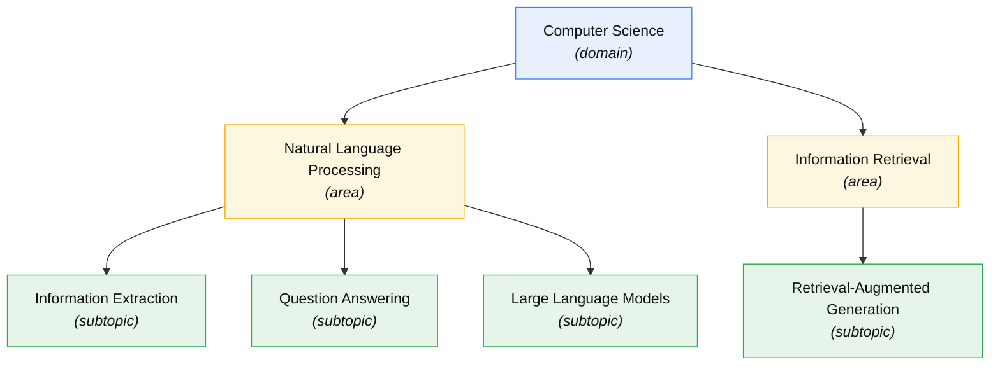

# Topic Taxonomy

The **Topic taxonomy** is agentic-kg's controlled vocabulary for classifying
research work. It is a hand-curated, three-level hierarchy that behaves as a
*closed set*: extraction can only classify a paper into topics that already
exist in the taxonomy — it cannot invent new ones.

- **Data (source of truth):** `packages/core/src/agentic_kg/knowledge_graph/data/seed_taxonomy.yml`
- **Loader / validator / exporter:** `knowledge_graph/taxonomy.py`
- **Node model:** `Topic` in `models/entities.py` (see [Entity Catalog](entity-catalog))
- **Level enum:** `TopicLevel` in `models/enums.py`
- **CLI:** `agentic-kg load-taxonomy`

## The three levels

`TopicLevel` defines exactly three levels; nesting is strict.

| Level | Meaning | Example | Parent |
|-------|---------|---------|--------|
| `domain` | Broad field | Computer Science | *(none — root)* |
| `area` | Sub-field within a domain | Natural Language Processing | a `domain` |
| `subtopic` | Specific topic within an area | Information Extraction | an `area` |



Edges above are `SUBTOPIC_OF` in the graph (child → parent). The diagram shows a
slice; the full seed set is below.

**Structural rules** (enforced by `parse_taxonomy` and the `Topic` model):

- Allowed parent → child transitions: `∅ → domain → area → subtopic`. A
  `subtopic` cannot nest further; a `domain` cannot appear as a child.
- A `domain` topic must **not** have a parent (`parent_id is None`).
- Names must be unique within the same `(parent, level)`.
- In the graph, hierarchy is materialized as `(child)-[:SUBTOPIC_OF]->(parent)`.

## Current seed taxonomy

Six areas under a single `Computer Science` domain, focused on the project's
corpus (graph retrieval, knowledge graphs, NLP, ML, IR). This mirrors
`seed_taxonomy.yml` — edit that file, not this table, to change the taxonomy.

### Computer Science *(domain)*

| Area | Subtopics |
|------|-----------|
| **Natural Language Processing** | Information Extraction · Question Answering · Machine Translation · Text Summarization · Large Language Models |
| **Information Retrieval** | Graph-Based Retrieval · Dense Retrieval · Retrieval-Augmented Generation · Hybrid Retrieval |
| **Knowledge Representation** | Knowledge Graphs · Ontology Engineering · Entity Linking |
| **Machine Learning** | Deep Learning · Transfer Learning · Graph Neural Networks · Self-Supervised Learning · Reinforcement Learning |
| **Data Management** | Graph Databases · Vector Databases |
| **AI Agents and Reasoning** | Multi-Agent Systems · Tool Use · Chain-of-Thought Reasoning |

Each node also carries a one-line `description` (see the YAML) that feeds a
richer embedding for semantic matching.

## YAML schema

The taxonomy file is a recursive list of nodes:

```yaml
- name: str             # required, length >= 2
  level: str            # required, one of domain/area/subtopic
  description: str      # optional — used for richer embeddings
  source: str           # optional, default "manual"
  openalex_id: str      # optional
  children: list        # optional, same schema, one level deeper
```

`flatten_taxonomy` walks this recursively (no fixed depth assumption), so a
future taxonomy deeper than three levels would work without code changes —
though the level *enum* would need extending first.

## How the taxonomy is used

- **Loading (idempotent).** `load_taxonomy` merges each node via
  `repository.merge_topic` keyed on `(name, level, parent_id)`, creating
  `SUBTOPIC_OF` edges automatically. Re-running is a no-op for unchanged nodes
  and reports `{created, matched}` counts.
- **Closed-set extraction.** `TopicExtractor` snapshots the taxonomy at startup
  and builds a closed-set `Literal` schema over its names, so the LLM can only
  return topics that exist in the taxonomy — off-taxonomy classifications are
  impossible by construction.
- **Staleness auditing.** `extraction/taxonomy_hash.py` computes a canonical
  hash (`canonical_taxonomy_hash`) over the taxonomy. Papers are stamped with
  the hash they were ingested under, so when the taxonomy changes, previously
  ingested papers can be detected as stale and re-classified.
- **Export / round-trip.** `export_taxonomy` reads the live graph back into the
  YAML shape (embeddings excluded, regenerated on import), keeping the file
  human-editable.

## Vocabulary style vs. other entities

The Topic taxonomy is the graph's only **closed-set** vocabulary. The other
concept-like nodes are open:

| Node | Vocabulary | New values enter by |
|------|-----------|---------------------|
| `Topic` | **closed-set** | editing the seed taxonomy + reload |
| `Model` | hybrid (open + canonical seeds) | extraction; seeds write-protected |
| `ResearchConcept` | open-set | extraction; deduped at 0.90 cosine |
| `Method` | open-set | extraction; deduped at 0.90 cosine |

## Known limitations / roadmap

Scaling the taxonomy is a tracked, open backlog item — **T-1** in
`llm/features/BACKLOG.md`: *"Taxonomy management at scale — versioned taxonomy
with branching + merge + conflict resolution."* Today the taxonomy is a single
hand-curated file with no versioning or branching; growing it or reconciling
concurrent edits is a manual, re-extract operation.
